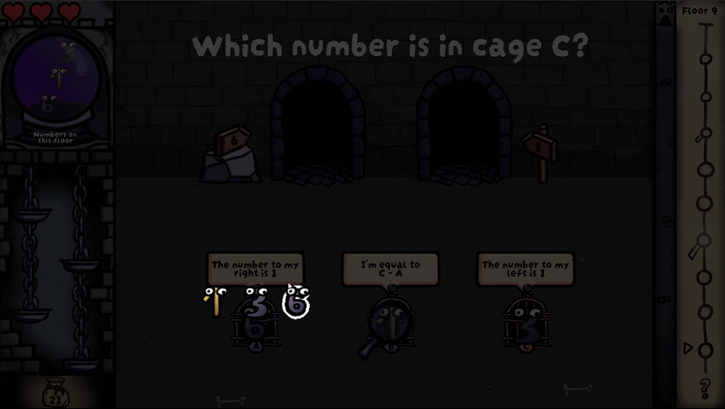
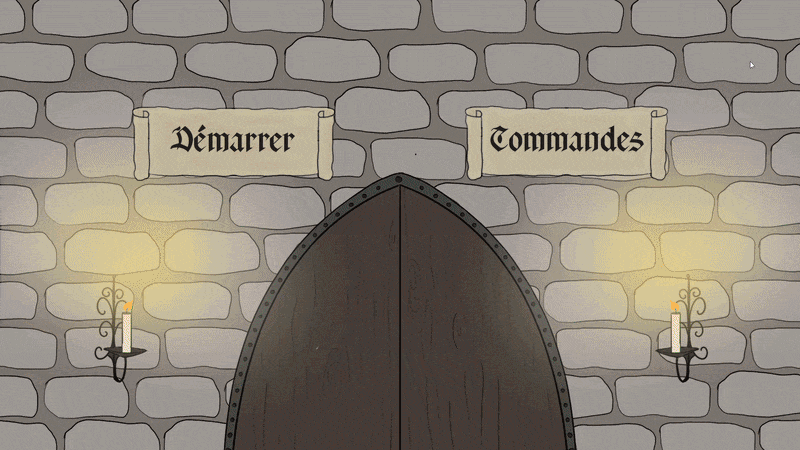
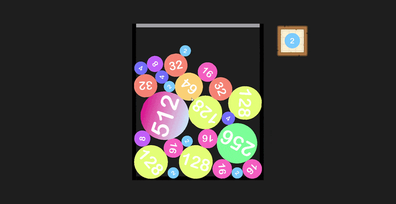
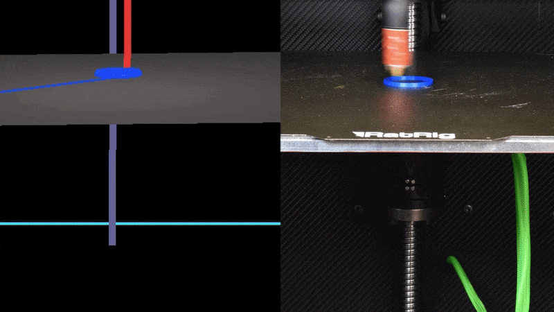

## Hi I'm Thibaut

- 🇫🇷 French engineering student
- 🎮 Creating video games in his free time
- 🧐 Always interested in learning new skills

### Showcase of my main projects

<table>
  <tr>
    <td align="center">
      <strong>Curse of the Number Dungeon</strong> 
      
    </td>
    <td width="20"></td>
    <td align="center">
      <strong>Cool Down</strong> 
      
    </td>
  </tr>
  <tr>
    <td align="center">
      <strong>Snooze</strong> 
      
    </td>
    <td width="20"></td>
    <td align="center">
      <strong>Castle Cleaners</strong> 
      
    </td>
  </tr>
  <tr>
    <td align="center">
      <strong>Watermelon (2048) Game</strong> 
      
    </td>
    <td width="20"></td>
    <td align="center">
      <strong>Numerical twin of a 3D printer</strong> 
      
    </td>
  </tr>
</table>
